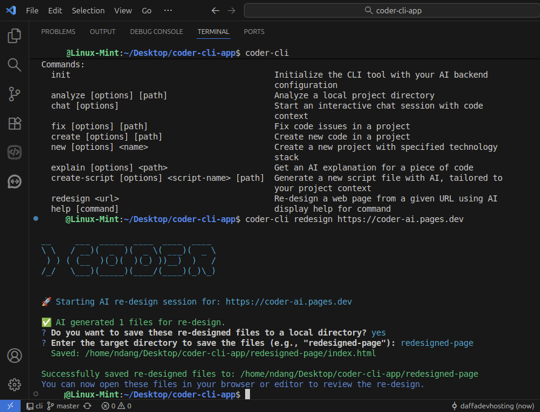

# Coder CLI

[](https://www.npmjs.com/package/@jekyll-studio/coder-cli) 

AI-powered CLI tool for code analysis, creation, and fixes. This tool integrates with your AI backend to provide intelligent coding assistance right from your terminal.

```
__    ___  _____  ____  ____  ____ 
\\ \  / __)(  _  )(  _ \( ___)(  _ \
 > >( (__  )(_)(  )(_) ))__)  )   /
/_/  \___)(_____)(____/(____)(_)\\_)
```
)
## Installation

Install the CLI globally from npm to use the `coder-cli` command anywhere on your system.

```bash
npm install -g @jekyll-studio/coder-cli
```

> **Note:** This makes two commands available: `coder-cli` (the primary command) and `coder` (a shorter alias). The `coder` alias might not be available if another program on your system is already using it. This documentation will use `coder-cli` in all examples for consistency.

## Configuration

Before using the CLI for the first time, you need to configure it with your AI backend API key.

```bash
coder-cli init
```

This will launch an interactive setup wizard that will ask for your API key and save it in a local configuration file (`~/.coder-cli-config.json`).

## Usage

Here are the main commands available:

### `init`
Initializes or re-configures the CLI tool.

```bash
coder-cli init
```

### `chat`
Starts an interactive chat session. You can provide a local project or a remote Git repository as context for the AI.

```bash
# Start a chat session in the current directory
coder-cli chat

# Use a specific local project as context
coder-cli chat --project /path/to/your/project

# Use a remote public Git repository as context
coder-cli chat --repo https://github.com/user/repo.git
```

### `analyze`
Performs a high-level analysis of a project, identifying its structure, main technologies, and potential areas for improvement.

```bash
# Analyze the project in the current directory
coder-cli analyze

# Analyze a specific project path
coder-cli analyze /path/to/your/project
```

### `fix`
Starts a chat session in "fix" mode to help you resolve a specific issue.

```bash
# Fix an issue in the current project directory
coder-cli fix --issue "The login button is not working on the main page."

# Fix an issue in a specific project path
coder-cli fix /path/to/your/project --issue "There is a null pointer exception in the user service."
```

### `create`
Starts a chat session in "create" mode to generate new code based on a specification.

```bash
# Create new code in the current project directory
coder-cli create --spec "Create a REST API endpoint for user registration."

# Create new code in a specific project path
coder-cli create /path/to/your/project --spec "Add a React component for a contact form."
```
---
